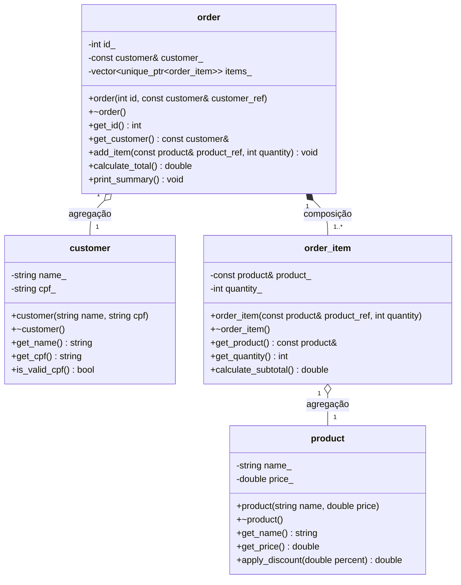

# Sistema de Pedidos de Lanchonete

## Identificação

**Nome:** Nicole Costa e Silva
**Matrícula:** 20250018913

## Descrição do domínio

Este projeto implementa um pequeno sistema orientado a objetos para representar pedidos em uma lanchonete.
O sistema permite cadastrar produtos, representar clientes, criar pedidos e adicionar itens ao pedido.
Cada pedido calcula automaticamente o valor total com base nos produtos e nas quantidades escolhidas.
O objetivo principal é demonstrar conceitos de encapsulamento, composição, agregação e uso de smart pointers em C++17.

## Diagrama UML de Classes



## Justificativa das relações

### Composição

A classe `order` possui uma relação de composição com `order_item`.

Isso acontece porque os itens são criados dentro do pedido por meio do método `add_item()`. Os objetos `order_item` não existem de forma independente no `main()`. Quando o objeto `order` é destruído, todos os seus itens também são destruídos automaticamente.

Por isso, o ciclo de vida dos itens depende diretamente do ciclo de vida do pedido.

### Agregação

A classe `order` possui uma relação de agregação com `customer`.

Isso acontece porque o cliente é criado fora do pedido e apenas referenciado por ele. Mesmo após a destruição do pedido, o cliente continua existindo e pode ser acessado normalmente.

A classe `order_item` também possui uma relação de agregação com `product`.

Isso acontece porque os produtos são criados independentemente do pedido. O item do pedido apenas referencia um produto já existente, sem ser responsável por destruí-lo.

## Smart Pointers

Neste projeto, foi utilizado `std::unique_ptr<order_item>` dentro da classe `order`.

A escolha de `unique_ptr` é adequada porque o pedido possui posse exclusiva sobre seus itens. Cada `order_item` pertence a um único `order` e deve ser destruído automaticamente quando o pedido for destruído.

Nas relações de agregação, foram utilizadas referências constantes, como `const customer&` e `const product&`, pois o pedido e o item apenas observam objetos que existem independentemente deles. Assim, não há posse sobre esses objetos.

## Como compilar

Para compilar o projeto com CMake, execute:

```bash
cmake -B build -G "MinGW Makefiles" -DCMAKE_BUILD_TYPE=Debug
cmake --build build
```

No Windows, use `.\build\lanchonete_poo.exe` para executar.

## Como executar

Após compilar, execute:

```bash
./build/lanchonete_poo
```

No Windows:

```powershell
.\build\lanchonete_poo.exe
```

## Funcionalidades demonstradas

* Criação de produtos.
* Criação de cliente.
* Validação simples de CPF.
* Aplicação de desconto em produto.
* Criação de pedido.
* Adição de itens ao pedido.
* Cálculo de subtotal por item.
* Cálculo do total do pedido.
* Demonstração de composição.
* Demonstração de agregação.
* Demonstração de destrutores com saída no terminal.
* Uso de `std::unique_ptr` para composição.
