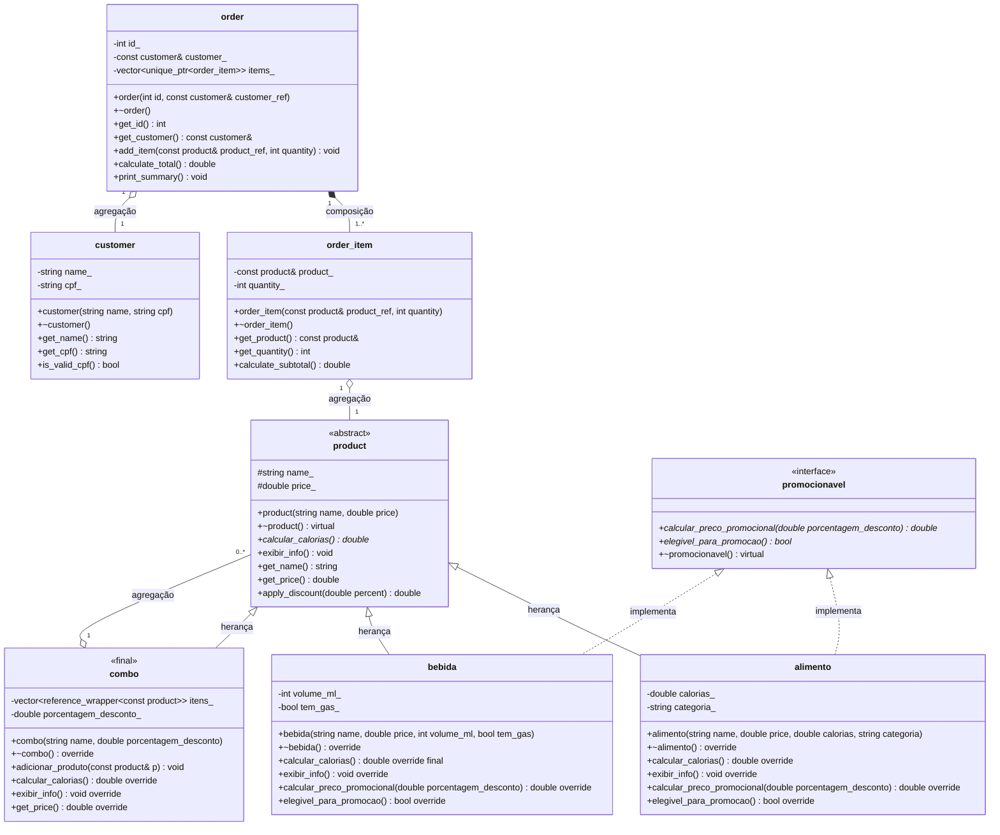

# Sistema de Pedidos de Lanchonete

## Identificação

**Nome:** Nicole Costa e Silva
**Matrícula:** 20250018913

## Descrição do domínio

Este projeto implementa um pequeno sistema orientado a objetos para representar pedidos em uma lanchonete.
O sistema permite cadastrar produtos, representar clientes, criar pedidos e adicionar itens ao pedido.
Cada pedido calcula automaticamente o valor total com base nos produtos e nas quantidades escolhidas.
O objetivo principal é demonstrar conceitos de encapsulamento, composição, agregação, herança, polimorfismo e uso de smart pointers em C++17.

## Diagrama UML de Classes


```mermaid
classDiagram
    class product {
        <<abstract>>
        #string name_
        #double price_
        +product(string name, double price)
        +~product() virtual
        +calcular_calorias() double*
        +exibir_info() void
        +get_name() string
        +get_price() double
        +apply_discount(double percent) double
    }

    class promocionavel {
        <<interface>>
        +calcular_preco_promocional(double porcentagem_desconto) double*
        +elegivel_para_promocao() bool*
        +~promocionavel() virtual
    }

    class alimento {
        -double calorias_
        -string categoria_
        +alimento(string name, double price, double calorias, string categoria)
        +~alimento() override
        +calcular_calorias() double override
        +exibir_info() void override
        +calcular_preco_promocional(double porcentagem_desconto) double override
        +elegivel_para_promocao() bool override
    }

    class bebida {
        -int volume_ml_
        -bool tem_gas_
        +bebida(string name, double price, int volume_ml, bool tem_gas)
        +~bebida() override
        +calcular_calorias() double override final
        +exibir_info() void override
        +calcular_preco_promocional(double porcentagem_desconto) double override
        +elegivel_para_promocao() bool override
    }

    class combo {
        <<final>>
        -vector~reference_wrapper~const product~~ itens_
        -double porcentagem_desconto_
        +combo(string name, double porcentagem_desconto)
        +~combo() override
        +adicionar_produto(const product& p) void
        +calcular_calorias() double override
        +exibir_info() void override
        +get_price() double override
    }

    class customer {
        -string name_
        -string cpf_
        +customer(string name, string cpf)
        +~customer()
        +get_name() string
        +get_cpf() string
        +is_valid_cpf() bool
    }

    class order_item {
        -const product& product_
        -int quantity_
        +order_item(const product& product_ref, int quantity)
        +~order_item()
        +get_product() const product&
        +get_quantity() int
        +calculate_subtotal() double
    }

    class order {
        -int id_
        -const customer& customer_
        -vector~unique_ptr~order_item~~ items_
        +order(int id, const customer& customer_ref)
        +~order()
        +get_id() int
        +get_customer() const customer&
        +add_item(const product& product_ref, int quantity) void
        +calculate_total() double
        +print_summary() void
    }

    product <|-- alimento : herança
    product <|-- bebida : herança
    product <|-- combo : herança
    promocionavel <|.. alimento : implementa
    promocionavel <|.. bebida : implementa
    order "1" *-- "1..*" order_item : composição
    order "1" o-- "1" customer : agregação
    order_item "1" o-- "1" product : agregação
    combo "1" o-- "0..*" product : agregação
```

## Justificativa das relações

### Composição

A classe `order` possui uma relação de composição com `order_item`.

Isso acontece porque os itens são criados dentro do pedido por meio do método `add_item()`. Os objetos `order_item` não existem de forma independente no `main()`. Quando o objeto `order` é destruído, todos os seus itens também são destruídos automaticamente.

Por isso, o ciclo de vida dos itens depende diretamente do ciclo de vida do pedido.

### Agregação

A classe `order` possui uma relação de agregação com `customer`.

Isso acontece porque o cliente é criado fora do pedido e apenas referenciado por ele. Mesmo após a destruição do pedido, o cliente continua existindo e pode ser acessado normalmente.

A classe `order_item` também possui uma relação de agregação com `product`.

Isso acontece porque os produtos são criados independentemente do pedido. O item do pedido apenas referencia um produto já existente, sem ser responsável por destruí-lo.

A classe `combo` também possui uma relação de agregação com `product`, pois os produtos que compõem o combo são referenciados, não possuídos pelo combo.

### Herança

As classes `alimento`, `bebida` e `combo` herdam de `product` (classe abstrata).

`product` define a interface comum para todos os tipos de produtos, incluindo um método virtual puro `calcular_calorias()` que obriga as derivadas a implementarem o cálculo de calorias específico de cada tipo.

### Herança Múltipla de Interfaces

As classes `alimento` e `bebida` implementam a interface pura `promocionavel`, permitindo que participem de promoções. Esta é uma herança múltipla segura, pois `promocionavel` é uma interface pura (sem estado).

## Herança Avançada

### Uso do `final`

#### Classe `final`: `combo`

A classe `combo` foi marcada como `final` para impedir especializações adicionais.

**Justificativa:** Um combo já representa a combinação de produtos em uma oferta especial com desconto. Criar subclasses de combo (como "combo do combo") não faz sentido no domínio de lanchonete e apenas adicionaria complexidade desnecessária. Além disso, marcar como `final` garante que a lógica de desconto do combo não seja adulterada por subclasses, mantendo a integridade das promoções.

**Garantia de design:** Evita hierarquias excessivamente profundas e protege a lógica de negócio crítica (cálculo de preço com desconto).

#### Método `final`: `calcular_calorias()` em `bebida`

O método `calcular_calorias()` na classe `bebida` foi marcado como `final`.

**Justificativa:** O cálculo de calorias de bebidas é baseado em tabelas nutricionais padronizadas e fórmulas fixas (volume × densidade calórica). Mesmo que futuramente existam subtipos de bebida (refrigerante diet, suco integral, etc.), o cálculo deve seguir sempre a mesma fórmula base estabelecida pela classe `bebida`.

**Garantia de design:** Garante consistência nutricional em todo o sistema, impedindo que subclasses alterem arbitrariamente o cálculo de calorias, o que poderia resultar em informações incorretas para os clientes.

## Smart Pointers

Neste projeto, foi utilizado `std::unique_ptr<order_item>` dentro da classe `order`.

A escolha de `unique_ptr` é adequada porque o pedido possui posse exclusiva sobre seus itens. Cada `order_item` pertence a um único `order` e deve ser destruído automaticamente quando o pedido for destruído.

Nas relações de agregação, foram utilizadas referências constantes, como `const customer&` e `const product&`, pois o pedido e o item apenas observam objetos que existem independentemente deles. Assim, não há posse sobre esses objetos.

No TP2, também utilizamos `std::vector<std::unique_ptr<product>>` para armazenar polimorficamente produtos derivados, demonstrando o uso de smart pointers com polimorfismo dinâmico.

## Como compilar

Para compilar o projeto com CMake, execute:

```bash
cmake -B build -DCMAKE_BUILD_TYPE=Debug
cmake --build build
```

## Como executar

Após compilar, execute o programa principal:

```bash
./build/lanchonete_poo
```

Para executar os testes automatizados com Catch2:

```bash
cd build
ctest --output-on-failure
```

Ou execute diretamente o executável de testes:

```bash
./build/testes
```

## Funcionalidades demonstradas

### TP1 (Sistema Base)
* Criação de produtos.
* Criação de cliente.
* Validação simples de CPF.
* Aplicação de desconto em produto.
* Criação de pedido.
* Adição de itens ao pedido.
* Cálculo de subtotal por item.
* Cálculo do total do pedido.
* Demonstração de composição.
* Demonstração de agregação.
* Demonstração de destrutores com saída no terminal.
* Uso de `std::unique_ptr` para composição.

### TP2 (Herança e Polimorfismo)
* Hierarquia de herança com classe abstrata `product`.
* Três classes derivadas: `alimento`, `bebida`, `combo`.
* Método virtual puro `calcular_calorias()`.
* Método virtual não-puro `exibir_info()` com implementação padrão.
* Destrutor virtual demonstrado via ponteiro base.
* Polimorfismo dinâmico com `vector<unique_ptr<product>>`.
* Função livre `encontrar_maior_calorias()` operando sobre ponteiros base.
* Interface pura `promocionavel` sem estado.
* Herança múltipla de interfaces em `alimento` e `bebida`.
* Uso de `final` em classe (`combo`).
* Uso de `final` em método (`calcular_calorias()` em `bebida`).
* Testes automatizados com Catch2.

