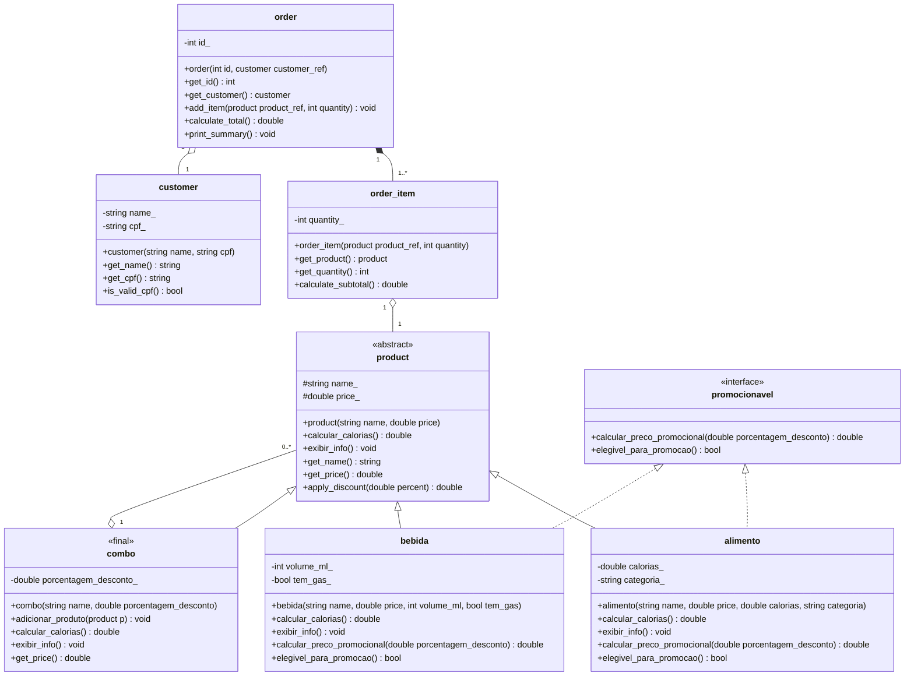
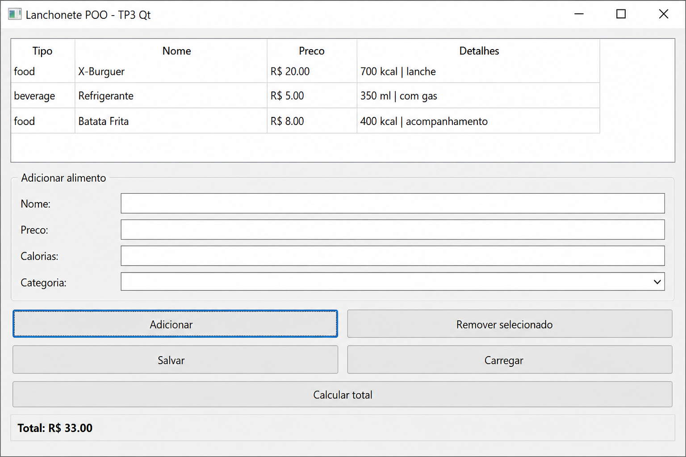

# Sistema de Pedidos de Lanchonete

## Identificação

**Nome:** Nicole Costa e Silva
**Matrícula:** 20250018913

## Descrição do domínio

Este projeto implementa um pequeno sistema orientado a objetos para representar pedidos em uma lanchonete.
O sistema permite cadastrar produtos, representar clientes, criar pedidos e adicionar itens ao pedido.
Cada pedido calcula automaticamente o valor total com base nos produtos e nas quantidades escolhidas.
O objetivo principal é demonstrar conceitos de encapsulamento, composição, agregação, herança, polimorfismo, programação genérica, tratamento de erros, STL, concorrência, serialização, SOLID e uso de smart pointers em C++20.

## Diagrama UML de Classes


```mermaid
classDiagram
    class product {
        <<abstract>>
        #string name_
        #double price_
        +product(string name, double price)
        +calcular_calorias() double
        +exibir_info() void
        +get_name() string
        +get_price() double
        +apply_discount(double percent) double
    }

    class promocionavel {
        <<interface>>
        +calcular_preco_promocional(double porcentagem_desconto) double
        +elegivel_para_promocao() bool
    }

    class alimento {
        -double calorias_
        -string categoria_
        +alimento(string name, double price, double calorias, string categoria)
        +calcular_calorias() double
        +exibir_info() void
        +calcular_preco_promocional(double porcentagem_desconto) double
        +elegivel_para_promocao() bool
    }

    class bebida {
        -int volume_ml_
        -bool tem_gas_
        +bebida(string name, double price, int volume_ml, bool tem_gas)
        +calcular_calorias() double
        +exibir_info() void
        +calcular_preco_promocional(double porcentagem_desconto) double
        +elegivel_para_promocao() bool
    }

    class combo {
        <<final>>
        -double porcentagem_desconto_
        +combo(string name, double porcentagem_desconto)
        +adicionar_produto(product p) void
        +calcular_calorias() double
        +exibir_info() void
        +get_price() double
    }

    class customer {
        -string name_
        -string cpf_
        +customer(string name, string cpf)
        +get_name() string
        +get_cpf() string
        +is_valid_cpf() bool
    }

    class order_item {
        -int quantity_
        +order_item(product product_ref, int quantity)
        +get_product() product
        +get_quantity() int
        +calculate_subtotal() double
    }

    class order {
        -int id_
        +order(int id, customer customer_ref)
        +get_id() int
        +get_customer() customer
        +add_item(product product_ref, int quantity) void
        +calculate_total() double
        +print_summary() void
    }

    product <|-- alimento
    product <|-- bebida
    product <|-- combo
    promocionavel <|.. alimento
    promocionavel <|.. bebida
    order "1" *-- "1..*" order_item
    order "1" o-- "1" customer
    order_item "1" o-- "1" product
    combo "1" o-- "0..*" product
```

## Justificativa das relações

### Composição

A classe `order` possui uma relação de composição com `order_item`.

Isso acontece porque os itens são criados dentro do pedido por meio do método `add_item()`. Os objetos `order_item` não existem de forma independente no `main()`. Quando o objeto `order` é destruído, todos os seus itens também são destruídos automaticamente.

Por isso, o ciclo de vida dos itens depende diretamente do ciclo de vida do pedido.

### Agregação

A classe `order` possui uma relação de agregação com `customer`.

Isso acontece porque o cliente é criado fora do pedido e apenas referenciado por ele. Mesmo após a destruição do pedido, o cliente continua existindo e pode ser acessado normalmente.

A classe `order_item` também possui uma relação de agregação com `product`.

Isso acontece porque os produtos são criados independentemente do pedido. O item do pedido apenas referencia um produto já existente, sem ser responsável por destruí-lo.

A classe `combo` também possui uma relação de agregação com `product`, pois os produtos que compõem o combo são referenciados, não possuídos pelo combo.

### Herança

As classes `alimento`, `bebida` e `combo` herdam de `product` (classe abstrata).

`product` define a interface comum para todos os tipos de produtos, incluindo um método virtual puro `calcular_calorias()` que obriga as derivadas a implementarem o cálculo de calorias específico de cada tipo.

### Herança Múltipla de Interfaces

As classes `alimento` e `bebida` implementam a interface pura `promocionavel`, permitindo que participem de promoções. Esta é uma herança múltipla segura, pois `promocionavel` é uma interface pura (sem estado).

## Herança Avançada

### Uso do `final`

#### Classe `final`: `combo`

A classe `combo` foi marcada como `final` para impedir especializações adicionais.

**Justificativa:** Um combo já representa a combinação de produtos em uma oferta especial com desconto. Criar subclasses de combo (como "combo do combo") não faz sentido no domínio de lanchonete e apenas adicionaria complexidade desnecessária. Além disso, marcar como `final` garante que a lógica de desconto do combo não seja adulterada por subclasses, mantendo a integridade das promoções.

**Garantia de design:** Evita hierarquias excessivamente profundas e protege a lógica de negócio crítica (cálculo de preço com desconto).

#### Método `final`: `calcular_calorias()` em `bebida`

O método `calcular_calorias()` na classe `bebida` foi marcado como `final`.

**Justificativa:** O cálculo de calorias de bebidas é baseado em tabelas nutricionais padronizadas e fórmulas fixas (volume × densidade calórica). Mesmo que futuramente existam subtipos de bebida (refrigerante diet, suco integral, etc.), o cálculo deve seguir sempre a mesma fórmula base estabelecida pela classe `bebida`.

**Garantia de design:** Garante consistência nutricional em todo o sistema, impedindo que subclasses alterem arbitrariamente o cálculo de calorias, o que poderia resultar em informações incorretas para os clientes.

## Smart Pointers

Neste projeto, foi utilizado `std::unique_ptr<order_item>` dentro da classe `order`.

A escolha de `unique_ptr` é adequada porque o pedido possui posse exclusiva sobre seus itens. Cada `order_item` pertence a um único `order` e deve ser destruído automaticamente quando o pedido for destruído.

Nas relações de agregação, foram utilizadas referências constantes, como `const customer&` e `const product&`, pois o pedido e o item apenas observam objetos que existem independentemente deles. Assim, não há posse sobre esses objetos.

No TP2, também utilizamos `std::vector<std::unique_ptr<product>>` para armazenar polimorficamente produtos derivados, demonstrando o uso de smart pointers com polimorfismo dinâmico.

## Como compilar

Para compilar o projeto com CMake, execute:

```bash
cmake -B build -DCMAKE_BUILD_TYPE=Debug
cmake --build build
```

O TP3 usa `concepts` e `ranges`, portanto requer um compilador com suporte real a C++20, como GCC 11+, Clang 14+ ou MSVC moderno. O MinGW GCC 6.3.0 não é suficiente para esta etapa.

No Windows, use um terminal com toolchain moderna no `PATH`, por exemplo Developer PowerShell do Visual Studio ou MinGW-w64 recente. Se usar MinGW-w64, prefira:

```bash
cmake -B build -G "MinGW Makefiles" -DCMAKE_BUILD_TYPE=Debug
cmake --build build
```

## Como executar

Após compilar, execute o programa principal:

```bash
./build/lanchonete_poo
```

Para executar os testes automatizados com Catch2:

```bash
cd build
ctest --output-on-failure
```

Ou execute diretamente o executável de testes:

```bash
./build/testes
```

Para verificar concorrência com ThreadSanitizer em Linux/WSL com GCC moderno:

```bash
cmake -B build-tsan -DCMAKE_BUILD_TYPE=Debug -DENABLE_TSAN=ON
cmake --build build-tsan
ctest --test-dir build-tsan --output-on-failure
```

## Funcionalidades demonstradas

### TP1 (Sistema Base)
* Criação de produtos.
* Criação de cliente.
* Validação simples de CPF.
* Aplicação de desconto em produto.
* Criação de pedido.
* Adição de itens ao pedido.
* Cálculo de subtotal por item.
* Cálculo do total do pedido.
* Demonstração de composição.
* Demonstração de agregação.
* Demonstração de destrutores com saída no terminal.
* Uso de `std::unique_ptr` para composição.

### TP2 (Herança e Polimorfismo)
* Hierarquia de herança com classe abstrata `product`.
* Três classes derivadas: `alimento`, `bebida`, `combo`.
* Método virtual puro `calcular_calorias()`.
* Método virtual não-puro `exibir_info()` com implementação padrão.
* Destrutor virtual demonstrado via ponteiro base.
* Polimorfismo dinâmico com `vector<unique_ptr<product>>`.
* Função livre `encontrar_maior_calorias()` operando sobre ponteiros base.
* Interface pura `promocionavel` sem estado.
* Herança múltipla de interfaces em `alimento` e `bebida`.
* Uso de `final` em classe (`combo`).
* Uso de `final` em método (`calcular_calorias()` em `bebida`).
* Testes automatizados com Catch2.

### TP3 (Unidade III)
* `registry<T>` como template reutilizável, demonstrado com dois tipos no `main()`.
* CRTP com `counted<Derived>` para contagem estática de instâncias de `alimento`, `bebida` e `combo`.
* Concept `priced_item` restringindo `calculate_price_sum()`.
* Pipeline de ranges com `views::filter`, `views::values` e `views::transform`.
* Hierarquia própria de exceções com `domain_error` como base.
* Busca com `std::optional` em `menu_catalog::find_by_name()`.
* `std::variant` em `product_record`, tratado com `std::visit`.
* Contêineres STL `std::map` e `std::unordered_set` no catálogo.
* Algoritmos STL `sort`, `transform`, `count_if` e `accumulate`.
* Cálculo paralelo de calorias com `std::async`, `std::future`, `std::mutex` e `std::lock_guard`.
* Serialização JSON versionada com `nlohmann/json`.
* DIP com `state_repository`, `json_repository`, `memory_repository` e `lanchonete_app`.

## Programação Genérica

O template `registry<T>` abstrai um registro simples e reutilizável de itens, sem amarrar o código ao domínio de produtos. Ele é instanciado no `main()` com `std::string` e `int`, mostrando que não é apenas um `std::vector` renomeado para um caso específico.

O CRTP aparece em `counted<Derived>`. Ele foi escolhido em vez de herança virtual porque a contagem de instâncias é um comportamento estático por tipo derivado: `alimento::alive()`, `bebida::alive()` e `combo::alive()` não precisam de despacho dinâmico nem de custo de vtable.

O concept `priced_item` exige que o tipo tenha `get_price()` conversível para `double`. Assim, `calculate_price_sum(std::vector<alimento>{...})` compila, enquanto uma chamada como `calculate_price_sum(std::vector<int>{1, 2, 3})` falha apontando o concept, pois `int` não possui `get_price()`.

Antes, filtrar nomes de produtos caros exigiria um laço manual com `if` e `push_back`. Agora, `menu_catalog::expensive_product_names()` usa um pipeline de ranges: primeiro seleciona os valores do `map`, depois filtra por preço e por fim transforma cada produto em nome.

## Tratamento de Erros

A hierarquia de exceções começa em `domain_error`, derivada de `std::runtime_error`. Erros específicos como `invalid_quantity_error`, `invalid_product_error` e `repository_error` representam problemas reais: quantidade inválida no pedido, produto duplicado/categoria vazia e falha de persistência.

`menu_catalog::find_by_name()` retorna `std::optional<std::reference_wrapper<const product>>`, permitindo diferenciar explicitamente o caso encontrado do caso ausente sem usar ponteiro nulo ou exceção para fluxo normal.

`product_record` usa `std::variant<food_record, beverage_record, combo_record>` porque o estado serializado pode conter produtos concretos diferentes. O tratamento é feito com `std::visit`, mantendo o código explícito para cada alternativa.

## STL e Concorrência

O catálogo usa `std::map` para manter produtos indexados e ordenados por nome, e `std::unordered_set` para registrar categorias únicas com acesso médio O(1). Esses contêineres têm papéis diferentes e evitam reimplementar índices manualmente.

Os algoritmos da STL substituem laços equivalentes: `std::transform` extrai nomes e ponteiros, `std::sort` ordena por preço, `std::count_if` conta produtos acima de um limite com lambda que captura o limite, e `std::accumulate` soma preços/calorias.

`calculate_total_calories_parallel()` usa `std::async` porque o cálculo de calorias de cada produto é independente dos demais. Os resultados são coletados com `future::get()` e a soma compartilhada é protegida com `std::mutex` e `std::lock_guard`.

Para validar ausência de data races com ThreadSanitizer (Linux/WSL + GCC/Clang moderno):

```bash
cmake -B build-tsan -DCMAKE_BUILD_TYPE=Debug -DENABLE_TSAN=ON
cmake --build build-tsan
./build-tsan/lanchonete_poo
ctest --test-dir build-tsan --output-on-failure
```

Esperado: nenhuma linha `WARNING: ThreadSanitizer: data race`, e calorias paralelas iguais às seriais. No Windows nativo o TSan normalmente não está disponível; use WSL para essa checagem.

## Serialização e SOLID

A serialização usa `nlohmann/json` com funções `to_json`/`from_json` não intrusivas. O documento JSON possui `version = 1`, e cada produto serializado possui `type` para recriar a alternativa concreta de `product_record`.

SOLID no projeto:

* SRP: `menu_catalog` cuida do catálogo; `repository` cuida de persistência; `lanchonete_app` coordena a regra de alto nível.
* OCP: novos tipos serializáveis podem ser adicionados como novos records/alternativas sem mudar a interface `state_repository`.
* LSP: `alimento`, `bebida` e `combo` continuam substituíveis por `product&` nas operações polimórficas.
* ISP: `promocionavel` separa o contrato de promoção do contrato geral de `product`.
* DIP: `lanchonete_app` depende de `state_repository`, não de `json_repository`; nos testes, `memory_repository` substitui a persistência em arquivo.

A refatoração SRP principal foi separar catálogo, serialização e repositório em classes/arquivos próprios, em vez de colocar tudo em `main()` ou em `product`. O ponto de extensão OCP mais claro é a persistência: qualquer novo repositório pode implementar `state_repository` sem alterar `lanchonete_app`.

## Uso de IA

A IA foi usada como ferramenta de apoio para interpretar o enunciado, planejar a implementação, revisar decisões de design e organizar testes. As escolhas centrais permanecem documentadas no código e neste README para que cada parte possa ser explicada: por que usar CRTP, quando usar exceção, por que `optional` representa busca ausente, como `variant` modela produtos concretos e por que a operação paralela é independente por item.

## Qt

A interface gráfica da Questão 6 usa Qt Widgets em um alvo separado chamado `gui`. Ela é uma camada fina: `main_window` apenas lê campos da tela, chama `lanchonete_app` e atualiza a tabela. A lógica de estado, totalização, remoção e persistência continua no núcleo testável (`lanchonete_app`) e a gravação/carregamento passa pela abstração `state_repository`, usando `json_repository` com o arquivo padrão `estado_tp3.json`.

O CMake mantém o console e os testes independentes da GUI. Para compilar a interface, ative `BUILD_QT_GUI` em um ambiente com Qt6 Widgets instalado:

```bash
cmake -B build-qt -DCMAKE_BUILD_TYPE=Debug -DBUILD_QT_GUI=ON
cmake --build build-qt --target gui
```

No Windows com MSVC, abra o Developer PowerShell do Visual Studio e informe o caminho do Qt se ele não estiver no `PATH`:

```powershell
cmake -B build-qt -G "Visual Studio 17 2022" -DBUILD_QT_GUI=ON -DCMAKE_PREFIX_PATH="C:\Qt\6.6.0\msvc2019_64"
cmake --build build-qt --target gui --config Debug
.\build-qt\Debug\gui.exe
```

No Windows com MinGW-w64 moderno e Qt6 para MinGW:

```powershell
cmake -B build-qt -G "MinGW Makefiles" -DCMAKE_BUILD_TYPE=Debug -DBUILD_QT_GUI=ON -DCMAKE_PREFIX_PATH="C:\Qt\6.6.0\mingw_64"
cmake --build build-qt --target gui
.\build-qt\gui.exe
```

O alvo usa a configuração pedida no enunciado:

```cmake
find_package(Qt6 REQUIRED COMPONENTS Widgets)
qt_standard_project_setup()
qt_add_executable(gui src/gui_main.cpp src/main_window.cpp)
target_link_libraries(gui PRIVATE Qt6::Widgets)
```

### Screenshot

Janela da GUI em execução (`docs/screenshot_qt.png`):



Operações visíveis: listagem de produtos, formulário para adicionar alimento, botões Adicionar / Remover / Salvar / Carregar / Calcular total.
